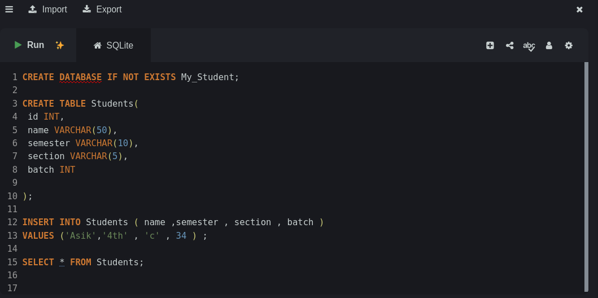

# SQL Learning Journey — Day 05
## Database Fundamentals: Database, Table, Row, Column 

Welcome to **Day 05 of my SQL Learning Journey**.

Today, I started learning SQL from the absolute basics. Instead of memorizing commands, my goal was to understand how databases store information, how tables organize data, and how SQL helps us insert and retrieve records.

This lesson covers the fundamental concepts and basic SQL operations needed before moving to more advanced database topics.

---

## Hands-On SQL Practice

Practiced writing and executing SQL queries to build a strong foundation in database operations.




## Table of Contents

- [1. What Is a Database?](#1-what-is-a-database)
- [2. What Is a Table?](#2-what-is-a-table)
- [3. What Is a Row?](#3-what-is-a-row)
- [4. What Is a Column?](#4-what-is-a-column)
- [5. Database vs. Table vs. Row vs. Column](#5-database-vs-table-vs-row-vs-column)
- [6. Understanding Data Types](#6-understanding-data-types)
- [7. Creating a Database](#7-creating-a-database)
- [8. Creating a Table](#8-creating-a-table)
- [9. Inserting Data into a Table](#9-inserting-data-into-a-table)
- [10. Retrieving Data with SELECT](#10-retrieving-data-with-select)
- [11. Selecting Specific Columns](#11-selecting-specific-columns)
- [12. Filtering Records with WHERE](#12-filtering-records-with-where)
- [13. Understanding SQL Query Output](#13-understanding-sql-query-output)
- [14. SQL Syntax Rules and Common Errors](#14-sql-syntax-rules-and-common-errors)
- [15. Complete Practical Example](#15-complete-practical-example)
- [16. What I Learned](#16-what-i-learned)
- [17. Practice Questions](#17-practice-questions)
- [18. Advanced Scenario-Based MCQ Examination](#18-advanced-scenario-based-mcq-examination)
- [19. Day 05 Summary](#19-day-01-summary)

---

## 1. What Is a Database?

A **database** is an organized collection of information that can be stored, accessed, and managed efficiently.

Imagine a university that needs to maintain information about students, teachers, courses, and departments.

Instead of keeping everything in separate, unorganized files, the university can store related information in a database.

For example, a database named `college_db` might contain:

- `students` — student information
- `teachers` — teacher information
- `courses` — course information

### Example

```sql
CREATE DATABASE college_db;
```

This SQL statement creates a database named `college_db`, provided the database does not already exist and the user has the necessary permissions.

**Real-world analogy:** A database is like a filing cabinet that organizes related information.

---

## 2. What Is a Table?

A **table** is a structured collection of related data inside a database.

A table organizes information into rows and columns.

For example, a university database might contain a table named `students`.

| ID | Name | Age | City |
|---:|---|---:|---|
| 1 | Nahid | 23 | Rajshahi |
| 2 | Nadia | 21 | Dhaka |
| 3 | Rafi | 22 | Dhaka |
| 4 | Sadia | 20 | Rajshahi |

In this example:

- `students` is the table name.
- The table contains student records.
- Each row represents one student.
- Each column represents a specific attribute of a student.

A database can contain multiple tables, and those tables do not need to have the same number of rows or columns.

---

## 3. What Is a Row?

A **row** represents one complete record in a table.

For example:

| ID | Name | Age | City |
|---:|---|---:|---|
| 3 | Rafi | 22 | Dhaka |

The entire record `(3, Rafi, 22, Dhaka)` is one row.

A row contains values associated with the columns in that table.

### Important points

- One new student normally means one new row.
- A row contains the information for a single record.
- Adding a row does not automatically add a new column.

If a table contains 100 student records and one new student is inserted, the table will normally contain 101 rows.

---

## 4. What Is a Column?

A **column** represents a particular attribute or field of the records stored in a table.

Consider the following table:

| ID | Name | Age | City |
|---:|---|---:|---|
| 1 | Nahid | 23 | Rajshahi |
| 2 | Nadia | 21 | Dhaka |
| 3 | Rafi | 22 | Dhaka |

The columns are:

- `ID`
- `Name`
- `Age`
- `City`

Each column represents a particular type of information.

For example:

- `Name` stores names.
- `Age` stores ages.
- `City` stores city names.

The column name is part of the table's structure. The values inside that column can differ from row to row.

**Important:** Adding a new student usually adds a row, not a column. Adding a new attribute, such as `Email`, may require adding a column to the table's structure.

---

## 5. Database vs. Table vs. Row vs. Column

| Concept | Meaning | Example |
|---|---|---|
| Database | An organized collection of related data | `college_db` |
| Table | A structured collection of records | `students` |
| Row | One complete record | `3, Rafi, 22, Dhaka` |
| Column | A specific attribute | `Name`, `Age`, `City` |
| Value | An individual piece of data | `Rafi`, `22`, `Dhaka` |

### Remember the hierarchy

```text
Database: college_db
    |
    |-- Table: students
    |       |
    |       |-- Columns: ID, Name, Age, City
    |       |
    |       |-- Row 1: 1, Nahid, 23, Rajshahi
    |       |-- Row 2: 2, Nadia, 21, Dhaka
    |       |-- Row 3: 3, Rafi, 22, Dhaka
    |
    |-- Table: teachers
    |
    |-- Table: courses
```

A database can contain multiple tables. Each table has its own structure and records.

---

## 6. Understanding Data Types

A **data type** defines what kind of value a column is designed to store.

For this lesson, we focused on two basic SQL data types.

### INT

`INT` is used for integer values.

Examples:

```sql
ID INT,
Age INT
```

Example values:

```text
1
20
23
100
```

### VARCHAR

`VARCHAR(n)` is used to store variable-length text, up to the specified maximum length `n`.

Examples:

```sql
Name VARCHAR(50),
City VARCHAR(50)
```

Example values:

```text
'Nahid'
'Rafi'
'Rajshahi'
'Dhaka'
```

### Example table definition

```sql
CREATE TABLE students (
    ID INT,
    Name VARCHAR(50),
    Age INT,
    City VARCHAR(50)
);
```

In this example:

| Column | Data Type | Purpose |
|---|---|---|
| ID | INT | Stores an integer ID |
| Name | VARCHAR(50) | Stores a name |
| Age | INT | Stores an integer age |
| City | VARCHAR(50) | Stores a city name |

**Remember:** The data type belongs to the column definition. Each value inserted into that column should be compatible with its data type.

---

## 7. Creating a Database

The `CREATE DATABASE` statement creates a new database.

```sql
CREATE DATABASE college_db;
```

### Explanation

- `CREATE DATABASE` tells SQL to create a database.
- `college_db` is the database name.
- `;` marks the end of the SQL statement.

Depending on the SQL environment, you may need permission to create a database. Some online SQL editors also provide a preselected database and do not allow users to create another one.

---

## 8. Creating a Table

The `CREATE TABLE` statement creates a table and defines its columns.

```sql
CREATE TABLE students (
    ID INT,
    Name VARCHAR(50),
    Age INT,
    City VARCHAR(50)
);
```

### Explanation

- `CREATE TABLE students` creates a table named `students`.
- `ID INT` defines the `ID` column as an integer.
- `Name VARCHAR(50)` defines the `Name` column as text.
- `Age INT` defines the `Age` column as an integer.
- `City VARCHAR(50)` defines the `City` column as text.

This statement creates the table structure. It does not automatically insert student records.

---

## 9. Inserting Data into a Table

The `INSERT INTO` statement adds new records to a table.

### Basic syntax

```sql
INSERT INTO table_name (column1, column2, column3)
VALUES (value1, value2, value3);
```

### Example 1: Insert a student

```sql
INSERT INTO students (ID, Name, Age, City)
VALUES (1, 'Nahid', 23, 'Rajshahi');
```

This inserts a record with:

- ID: `1`
- Name: `Nahid`
- Age: `23`
- City: `Rajshahi`

### Example 2: Insert another student

```sql
INSERT INTO students (ID, Name, Age, City)
VALUES (2, 'Nadia', 21, 'Dhaka');
```

### Example 3: Insert Rafi

```sql
INSERT INTO students (ID, Name, Age, City)
VALUES (3, 'Rafi', 22, 'Dhaka');
```

### Example 4: Insert Sadia

```sql
INSERT INTO students (ID, Name, Age, City)
VALUES (4, 'Sadia', 20, 'Rajshahi');
```

### Important rule: Column order and value order

Consider:

```sql
INSERT INTO students (ID, Name, Age, City)
VALUES (5, 'Imran', 24, 'Khulna');
```

The values must correspond to the specified columns in the same order.

| Column | Value |
|---|---|
| ID | 5 |
| Name | Imran |
| Age | 24 |
| City | Khulna |

If the order does not match, the data may be assigned to the wrong columns or the database may reject the statement.

---

## 10. Retrieving Data with SELECT

The `SELECT` statement retrieves data from a table.

### Retrieve all columns

```sql
SELECT * FROM students;
```

The asterisk (`*`) means all columns.

If the table contains four columns—`ID`, `Name`, `Age`, and `City`—the query requests all four columns for the matching records.

### Example result

| ID | Name | Age | City |
|---:|---|---:|---|
| 1 | Nahid | 23 | Rajshahi |
| 2 | Nadia | 21 | Dhaka |
| 3 | Rafi | 22 | Dhaka |
| 4 | Sadia | 20 | Rajshahi |

The result depends on the records currently stored in the table.

**Remember:** `SELECT` retrieves information. It does not normally modify or delete the original records.

---

## 11. Selecting Specific Columns

Sometimes we do not need every column.

For example, suppose we only want the names of the students.

```sql
SELECT Name
FROM students;
```

This query returns the `Name` column for the records in `students`.

### Select multiple columns

```sql
SELECT Name, Age
FROM students;
```

This query returns only the `Name` and `Age` columns.

### Compare the two queries

**Query A**

```sql
SELECT * FROM students;
```

Returns all columns.

**Query B**

```sql
SELECT Name, Age FROM students;
```

Returns only `Name` and `Age`.

### Key lesson

The columns listed after `SELECT` determine which columns appear in the query result.

Selecting fewer columns does not permanently remove the other columns from the original table.

---

## 12. Filtering Records with WHERE

The `WHERE` clause filters records according to a condition.

Suppose we want to find students who live in Dhaka.

```sql
SELECT *
FROM students
WHERE City = 'Dhaka';
```

This query returns all columns for records where `City` equals `'Dhaka'`.

### Example result

| ID | Name | Age | City |
|---:|---|---:|---|
| 2 | Nadia | 21 | Dhaka |
| 3 | Rafi | 22 | Dhaka |

The exact output depends on the stored data and the database's comparison rules.

### Find a student by ID

```sql
SELECT *
FROM students
WHERE ID = 2;
```

This retrieves the record or records matching `ID = 2`.

### Select only the names of students from Dhaka

```sql
SELECT Name
FROM students
WHERE City = 'Dhaka';
```

This query combines two ideas:

- `SELECT Name` determines which column to display.
- `WHERE City = 'Dhaka'` determines which records to include.

### The most important distinction

| SQL Component | Purpose |
|---|---|
| `SELECT` | Determines which columns to retrieve |
| `FROM` | Specifies the source table |
| `WHERE` | Filters records based on a condition |

**Remember:** `SELECT` controls the displayed columns; `WHERE` controls which rows match the condition.

---

## 13. Understanding SQL Query Output

A SQL statement should be understood by predicting its result, not just by memorizing its syntax.

Consider this table:

| ID | Name | Age | City |
|---:|---|---:|---|
| 1 | Nahid | 23 | Rajshahi |
| 2 | Nadia | 21 | Dhaka |
| 3 | Rafi | 22 | Dhaka |
| 4 | Sadia | 20 | Rajshahi |

### Query 1

```sql
SELECT Name
FROM students;
```

Expected result:

| Name |
|---|
| Nahid |
| Nadia |
| Rafi |
| Sadia |

Only the `Name` column appears.

### Query 2

```sql
SELECT *
FROM students
WHERE City = 'Dhaka';
```

Expected result:

| ID | Name | Age | City |
|---:|---|---:|---|
| 2 | Nadia | 21 | Dhaka |
| 3 | Rafi | 22 | Dhaka |

All columns appear, but only records matching the condition are returned.

### Query 3

```sql
SELECT Name, City
FROM students;
```

Expected result:

| Name | City |
|---|---|
| Nahid | Rajshahi |
| Nadia | Dhaka |
| Rafi | Dhaka |
| Sadia | Rajshahi |

The query returns two columns for all four records.

### Important observation

A query can return fewer columns than the original table while retaining multiple matching rows. A query result is not necessarily a permanent change to the table.

---

## 14. SQL Syntax Rules and Common Errors

### Rule 1: End statements with a semicolon

```sql
SELECT * FROM students;
```

A semicolon conventionally marks the end of a SQL statement.

### Rule 2: Use quotation marks for text values

Correct:

```sql
INSERT INTO students (ID, Name, Age, City)
VALUES (5, 'Imran', 24, 'Khulna');
```

Text values are enclosed in single quotes.

Integer values such as `5` and `24` are normally written without quotes.

### Rule 3: Match columns with values

Incorrect:

```sql
INSERT INTO students (ID, Name, Age, City)
VALUES (6, 'Mim', 'Rajshahi', 19);
```

The third value is assigned to `Age`, and the fourth to `City`. The values are in the wrong order.

Correct:

```sql
INSERT INTO students (ID, Name, Age, City)
VALUES (6, 'Mim', 19, 'Rajshahi');
```

### Rule 4: Use the correct table name

If the table is named `students`, referencing a nonexistent table name may produce an error.

```sql
SELECT * FROM students;
```

Check the table name and whether the table exists.

### Rule 5: Use valid column names

A misspelled or nonexistent column name may cause an error.

```sql
SELECT Name FROM students;
```

If the actual column is named `StudentName`, then `Name` may not be valid for that table.

### Rule 6: Understand the requested output

If the question asks for all columns, use:

```sql
SELECT * FROM students;
```

If it asks for only names, use:

```sql
SELECT Name FROM students;
```

If it asks for only students from Dhaka, add the appropriate condition:

```sql
SELECT * FROM students
WHERE City = 'Dhaka';
```

### Rule 7: A query can be syntactically valid but still be logically wrong

For example:

```sql
SELECT City
FROM students;
```

This is valid SQL, but it does not return the names of students from Dhaka. It returns the City values from all records.

Always check whether the query answers the actual question.

---

## 15. Complete Practical Example

This example combines the basic operations covered in Day 01.

### Step 1: Create a database

```sql
CREATE DATABASE college_db;
```

### Step 2: Select the database in MySQL

```sql
USE college_db;
```

Some online SQL environments already select a database for you. In those environments, `CREATE DATABASE` or `USE` may be unavailable.

### Step 3: Create a table

```sql
CREATE TABLE students (
    ID INT,
    Name VARCHAR(50),
    Age INT,
    City VARCHAR(50)
);
```

### Step 4: Insert records

```sql
INSERT INTO students (ID, Name, Age, City)
VALUES
    (1, 'Nahid', 23, 'Rajshahi'),
    (2, 'Nadia', 21, 'Dhaka'),
    (3, 'Rafi', 22, 'Dhaka'),
    (4, 'Sadia', 20, 'Rajshahi');
```

This multi-row `INSERT` syntax is supported by MySQL and several other common SQL database systems.

### Step 5: Display all records

```sql
SELECT * FROM students;
```

### Step 6: Display only names

```sql
SELECT Name FROM students;
```

### Step 7: Display names and ages

```sql
SELECT Name, Age FROM students;
```

### Step 8: Display students from Dhaka

```sql
SELECT * FROM students
WHERE City = 'Dhaka';
```

### Step 9: Find a student by ID

```sql
SELECT * FROM students
WHERE ID = 3;
```

The expected matching record is Rafi, provided the table contains the example data and the ID is unique.

---

## 16. What I Learned

By completing SQL Lesson 01, I learned:

- What a database is and why it is useful.
- How a database differs from a table.
- How rows represent records.
- How columns represent attributes.
- How column names differ from individual values.
- How `INT` and `VARCHAR` define basic data types.
- How to create a database and table.
- How to insert records using `INSERT INTO` and `VALUES`.
- How to retrieve all columns using `SELECT *`.
- How to retrieve specific columns using `SELECT`.
- How to filter records with `WHERE`.
- How to predict basic query output.
- Why the order of columns and values matters in an `INSERT` statement.
- How to identify common syntax and logical mistakes.

My main takeaway is that understanding the structure of data is more important than simply memorizing SQL commands.

---

## 17. Practice Questions

Try to solve these exercises without looking at the solutions first.

### Task 1: Insert a Record

Add a new student with the following information:

- ID: 5
- Name: Imran
- Age: 24
- City: Khulna

Write the correct SQL statement.

### Task 2: Retrieve Specific Columns

Write a query that displays only the `Name` and `Age` columns from the `students` table.

### Task 3: Filter Records

Write a query that displays all columns for students who live in Rajshahi.

### Task 4: Find a Specific Student

Write a query that retrieves the record where `ID = 2`.

### Task 5: Predict the Output

If the table contains four records, what will this query return?

```sql
SELECT Name
FROM students;
```

Explain which columns and rows appear in the result.

### Task 6: Identify the Mistake

Consider the following statement:

```sql
INSERT INTO students (ID, Name, Age, City)
VALUES (6, 'Mim', 'Rajshahi', 19);
```

Identify the mistake and rewrite the statement correctly.

### Task 7: Row and Column Reasoning

A table contains 150 rows and 6 columns. If one new record is added without changing the table structure, how many rows and columns will it contain afterward?

Explain your answer.

---

## 18. Advanced Scenario-Based MCQ Examination

**Total Marks:** 20  
**Time:** 20 Minutes  
**Difficulty:** Hard+  
**Questions:** 10 MCQs × 2 Marks = 20

### Instructions

- Select one correct answer for each question.
- Each correct answer earns 2 marks.
- No marks are awarded for incorrect answers.
- Read each scenario carefully before selecting your answer.

### Q1. Row vs. Column — Scenario Analysis (2 Marks)

A `students` table contains 300 rows and 5 columns. A new student is added, but no new type of information is introduced. What will the new table structure be?

A. 300 rows, 6 columns  
B. 301 rows, 5 columns  
C. 301 rows, 6 columns  
D. 299 rows, 5 columns

### Q2. Understanding Table Structure (2 Marks)

A table contains four columns: `ID`, `Name`, `Age`, and `City`. Which statement is correct?

A. Every row must have a different column name.  
B. Every column contains multiple different field names.  
C. Each row represents a record, while each column represents a specific attribute.  
D. A column and a value are the same thing.

### Q3. Database Independence (2 Marks)

A database contains a `students` table with 40 rows and a `teachers` table with 12 rows. Five additional records are inserted into the `students` table. What will the resulting row counts be?

A. Students: 45 rows; Teachers: 12 rows  
B. Students: 45 rows; Teachers: 17 rows  
C. Students: 40 rows; Teachers: 12 rows  
D. Students: 45 rows; Teachers: 45 rows

### Q4. SELECT Output Reasoning (2 Marks)

What will the following SQL statement return if the `students` table contains 20 records?

```sql
SELECT City FROM students;
```

A. Only students from Dhaka  
B. The City value from every record, displaying only the City column  
C. All values from every column  
D. Only the City value from the first record

### Q5. SELECT vs. WHERE (2 Marks)

Which SQL statement displays only the names of students who live in Dhaka?

A.

```sql
SELECT * FROM students WHERE City = 'Dhaka';
```

B.

```sql
SELECT Name FROM students;
```

C.

```sql
SELECT Name FROM students WHERE City = 'Dhaka';
```

D.

```sql
SELECT City FROM students WHERE Name = 'Dhaka';
```

### Q6. INSERT and Column Order (2 Marks)

The column order of a table is `ID`, `Name`, `Age`, and `City`. Which set of values correctly matches the column order?

A. `VALUES ('Rafi', 3, 'Dhaka', 22)`  
B. `VALUES (3, 'Rafi', 22, 'Dhaka')`  
C. `VALUES (3, 22, 'Rafi', 'Dhaka')`  
D. `VALUES ('Dhaka', 'Rafi', 22, 3)`

### Q7. Identify Row, Column, and Value (2 Marks)

Consider the following table. Which option correctly identifies a row, a column name, and a value?

| ID | Name | Age |
|---:|---|---:|
| 7 | Rafi | 22 |

A. Row = Name; Column = 22; Value = ID  
B. Row = 7; Column = Rafi; Value = Age  
C. Row = (7, Rafi, 22); Column = Age; Value = 22  
D. Row = Age; Column = (7, Rafi, 22); Value = Name

### Q8. Query Result vs. Original Table (2 Marks)

A table contains 60 rows and 4 columns. The following query is executed:

```sql
SELECT Name, City FROM students;
```

Which statement best describes the result?

A. The result will contain 2 rows.  
B. The result will contain up to 60 rows and 2 columns.  
C. The original table will permanently be reduced to 2 columns.  
D. The result will contain 60 columns.

### Q9. Critical Thinking: Row vs. Column (2 Marks)

A beginner makes the following statement:

“The `students` table has 4 columns. When a new student is added, the table will have 5 columns because the new student brings new information.”

Which is the best response?

A. Correct, because every student creates a new column.  
B. Incorrect, because a new student normally creates a new row, while columns represent fields shared across records.  
C. Correct, but only the ID changes.  
D. Incorrect, because tables cannot contain rows.

### Q10. Database Design Reasoning (2 Marks)

A university system needs to store information about students, teachers, and courses. Which database design is the most reasonable?

A. Create a separate database for every student.  
B. Store all student, teacher, and course information in a single cell.  
C. Use separate tables for different purposes within one database; each table may have a different number of rows and columns.  
D. Every table must have the same number of rows and columns.

### Answer Sheet

Q1: _____  
Q2: _____  
Q3: _____  
Q4: _____  
Q5: _____  
Q6: _____  
Q7: _____  
Q8: _____  
Q9: _____  
Q10: _____  

**Total Score: _____ / 20**

---

## 19. Day 01 Summary

SQL Lesson 01 established the foundation for working with relational databases.

The most important concepts to remember are:

1. A database can contain multiple tables.
2. A table organizes data into rows and columns.
3. A row represents a record.
4. A column represents an attribute.
5. A value is an individual piece of data stored in a field.
6. Adding a record normally adds a row, not a column.
7. `CREATE TABLE` defines the table structure.
8. `INSERT INTO` adds records.
9. `SELECT` retrieves the requested columns.
10. `WHERE` filters records based on a condition.

**Learning principle:** Understand what the data represents, determine which records you need, and then write the SQL statement.

**Next step:** Practice these fundamentals until you can explain each concept and write the basic queries without looking at notes.

---


## Quiz Achievement — SQL Fundamentals

**Score: 20/20 (100%)**

Successfully completed the advanced scenario-based MCQ examination covering SQL fundamentals, including databases, tables, rows, columns, data types, `INSERT`, `SELECT`, `WHERE`, query results, and basic database design concepts.

This result reflects my understanding of the fundamental concepts covered in SQL Lesson 01.


*This README documents my personal learning progress and practical exercises for SQL Lesson 01.*
